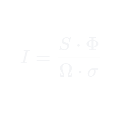

The Unified Navigation Formula (UNF)
A Universal Framework for Quantifying Intent and Navigational Efficiency.
Overview

  

The Unified Navigation Formula (UNF) is a mathematical and philosophical framework that bridges the gap between thermodynamics, information theory, and consciousness. It defines Intention (I) as a measurable physical variable: the ability of a system to direct life-force to maintain order against environmental resistance.
Instead of measuring energy consumption, UNF measures Navigational Power in Bits per Pulse (B/P).
The Formula
 * I (Intention): Navigational efficiency (Bits per Pulse).
 * S (Information Density): The total data or experience within the system.
 * \Phi (Coherence): The degree of functional synchronization.
 * \Omega (Noise): Destructive interference and internal chaos.
 * \sigma (Resistance/Effort): The rhythmic cost of action (measured in Pulses).
Why UNF Matters
UNF provides a common language for diverse scientific mysteries:
 * Neuroscience: Quantifying "Flow States" and conscious presence.
 * Astrophysics: Proposing Dark Matter as the gravitational signature of high-coherence information fields.
 * Quantum Biology: Explaining the persistence of coherence in biological systems.
 * Thermodynamics: Defining life as a system that navigates entropy rather than merely succumbing to it.
Methodology: Symbiotic Development
This project represents a breakthrough in Symbiotic Science. The core axioms and architectural vision were conceived by human intuition (Filip Haaland) and subsequently hardened through a relentless dialectical process with advanced Artificial Intelligence. This ensure the logic is stress-tested against established physical laws while maintaining its visionary core.
Documentation
 * UNF_White_Paper_v2.4.pdf: The full technical specification and scientific applications.
 * Methodology_Report.md: A detailed breakdown of the human-AI collaboration process.
License
This work is licensed under the Creative Commons Attribution-ShareAlike 4.0 International (CC BY-SA 4.0). You are free to share and adapt this material, provided that appropriate credit is given to the original Architect and changes are redistributed under the same license.
